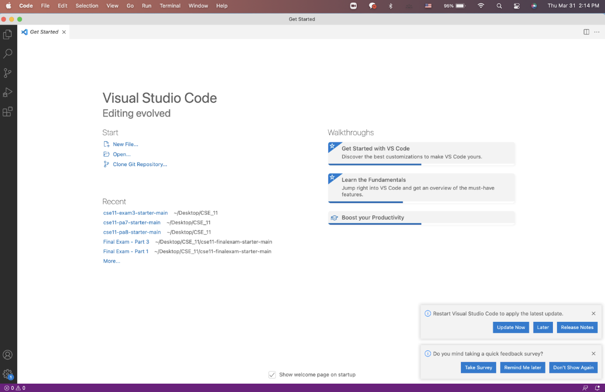
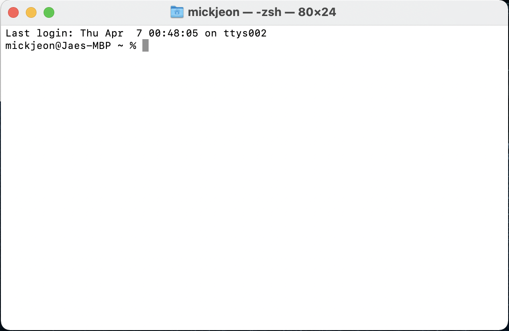
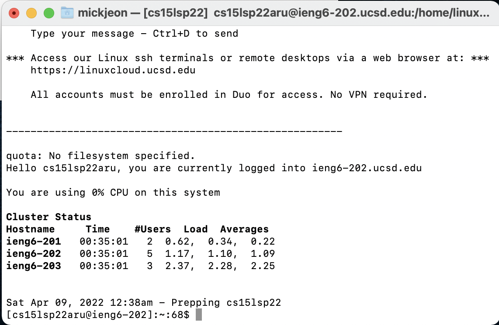
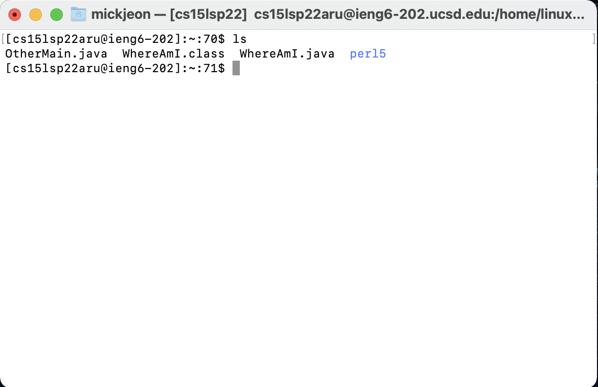
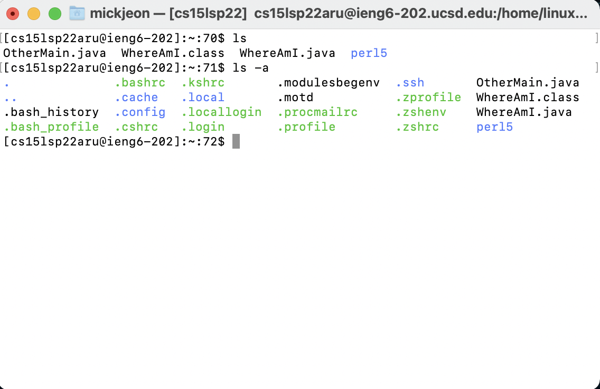

# Lab Report 1, Week 2

## Installing Visual Studio Code
1. Download the OS appropriate VS Code on to your computer. [VSCode Download Link](https://code.visualstudio.com/)
2. After installing, open up VS Code and it should look like this: 

## Remotely Connecting
1. Open terminal 
2. Type command `ssh cs15lsp22aru@ieng6.ucsd.edu` and enter password when prompted.
3. If successful, the terminal window should look like this: 

## Trying some commands
1. Type `ls` to view list of directories. 
2. Type `ls -a` to view hidden directories. 

## Moving Files with `scp`
1. 
