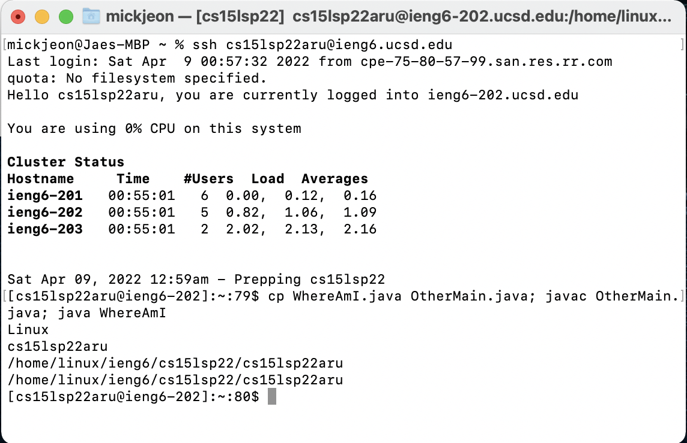

# Lab Report 1, Week 2

## Installing Visual Studio Code
1. Download the OS appropriate VS Code on to your computer. [VSCode Download Link](https://code.visualstudio.com/)
2. After installing, open up VS Code and it should look like this: 

## Remotely Connecting
1. Open terminal 
2. Type command `ssh cs15lsp22aru@ieng6.ucsd.edu` and enter password when prompted.
3. If successful, the terminal window should look like this: 

## Trying some commands
1. Type `ls` to view list of directories. 
2. Type `ls -a` to view hidden directories. 

## Moving Files with `scp`
1. Have or create a file that you want to move from your personal computer to remote server. (WhereAmI.java in this case)
2. Change directory into the directory that contains that file on your personal computer.
3. Type `scp WhereAMI.java cs15lsp22aru@ieng6.ucsd.edu:~/`
4. Use `ls` command on the remote server to check if the file was moved succesfully.

## Setting an SSH Key
1. On client, type `$ ssh-keygen`
2. Change to remote server and type `ls -a` to see if `.ssh` directory already exists. If not, make a directory by typing `mkdir .ssh`
3. Move back to client(`exit`), and enter the following command: `$ scp /Users/mickjeon/.ssh/id_rsa.pub cs15lsp22zz@ieng6.ucsd.edu:~/.ssh/authorized_keys`
4. If successful, you will not be prompted to type in a password when typing command `ssh cs15lsp22aru@ieng6.ucsd.edu`

## Optimize Remote Running
The following example is an optimized way to copy a file on the server, compiling, and running with using less than 10 key strokes
1. Type on Client `ssh cs15lsp22aru@ieng6.ucsd.edu`
2. Type on Server `cp WhereAmI.java OtherMain.java; "javac OtherMain.java; java WhereAmI"`
3. Change back to Client(`exit`)
4. Press arrow up to retreive command `ssh cs15lsp22aru@ieng6.ucsd.edu` 
5. Once on client, press arrow up to retreive command `cp WhereAmI.java OtherMain.java; javac OtherMain.java; java WhereAmI`
* The output should be as following: 
