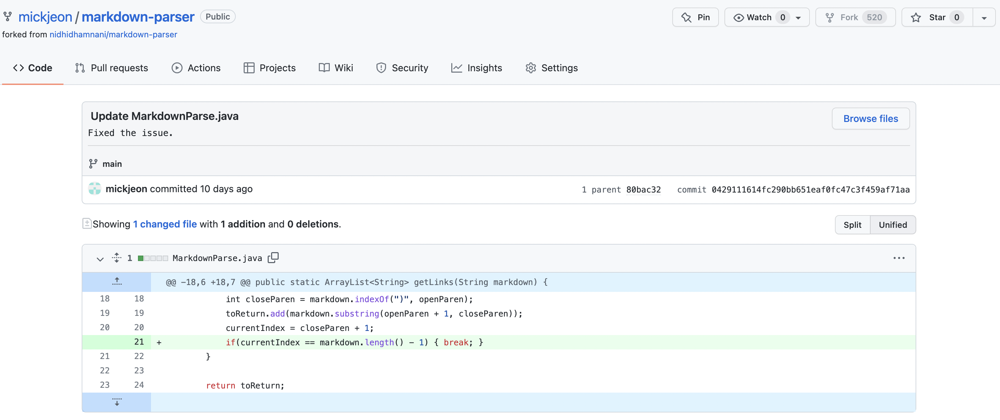
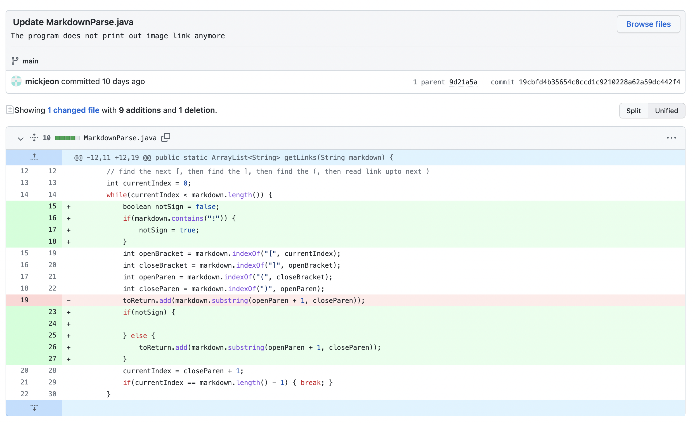
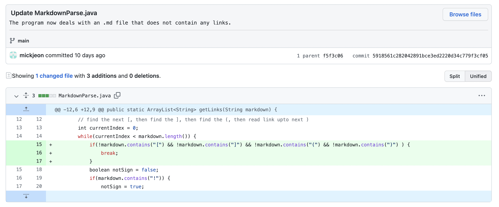

# Lab Report 2, Week 4
[Back to index page](https://mickjeon.github.io/cse15l-lab-reports/)

## Code changes to fix bugs in Markdown Parser

### 1. First Failure-Inducing Input
* Screenshot of the code change:

* [Link](https://github.com/mickjeon/markdown-parser/blob/main/my-file.md?plain=1) to failure-inducing input file.
* Symptom: 
```
Exception in thread "main" java.lang.OutOfMemoryError: Java heap space
        at java.base/java.util.Arrays.copyOf(Arrays.java:3512)
        at java.base/java.util.Arrays.copyOf(Arrays.java:3481)
        at java.base/java.util.ArrayList.grow(ArrayList.java:237)
        at java.base/java.util.ArrayList.grow(ArrayList.java:244)
        at java.base/java.util.ArrayList.add(ArrayList.java:454)
        at java.base/java.util.ArrayList.add(ArrayList.java:467)
        at MarkdownParse.getLinks(MarkdownParse.java:19)
        at MarkdownParse.main(MarkdownParse.java:29)
```
* Write 2-3 sentences describing the relationship between the bug

### 2. Second Failure-Inducing Input
* Screenshot of the code change:

* [Link](https://github.com/mickjeon/markdown-parser/blob/main/image.md?plain=1) to failure-inducing input file.
* Symptom: 
```
 Output: [image.png]
```
* Write 2-3 sentences describing the relationship between the bug

### 3. Third Failure-Inducing Input
* Screenshot of the code change:

* [Link](https://github.com/mickjeon/markdown-parser/blob/main/far-away.md?plain=1) to failure-inducing input file.
* Symptom: 
```
Exception in thread "main" java.lang.StringIndexOutOfBoundsException: begin 0, end -1, length 18
        at java.base/java.lang.String.checkBoundsBeginEnd(String.java:4601)
        at java.base/java.lang.String.substring(String.java:2704)
        at MarkdownParse.getLinks(MarkdownParse.java:26)
        at MarkdownParse.main(MarkdownParse.java:39)
```
* Write 2-3 sentences describing the relationship between the bug
