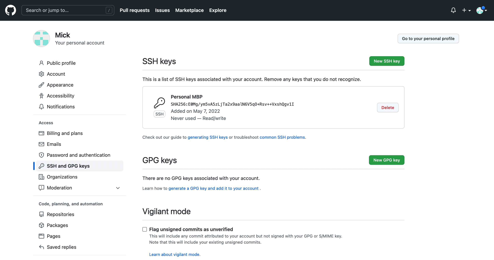
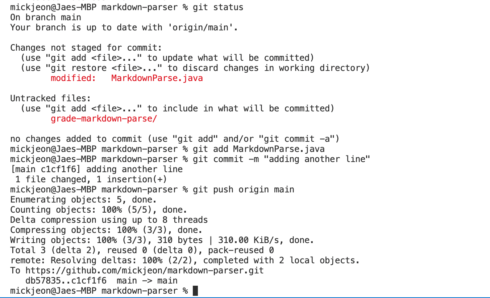
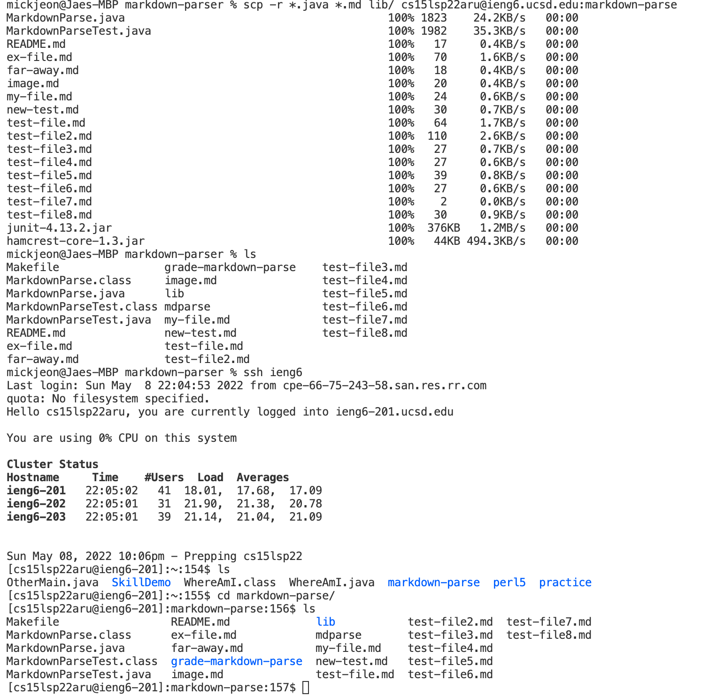
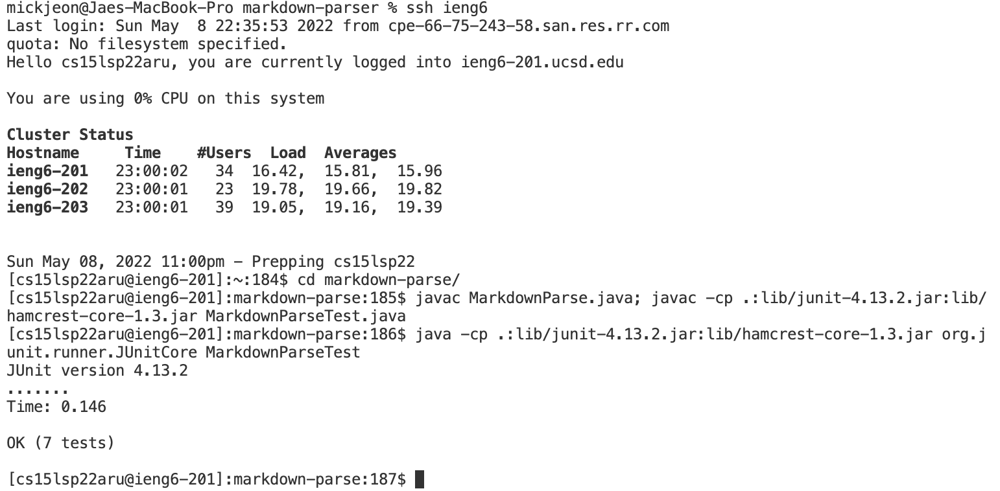
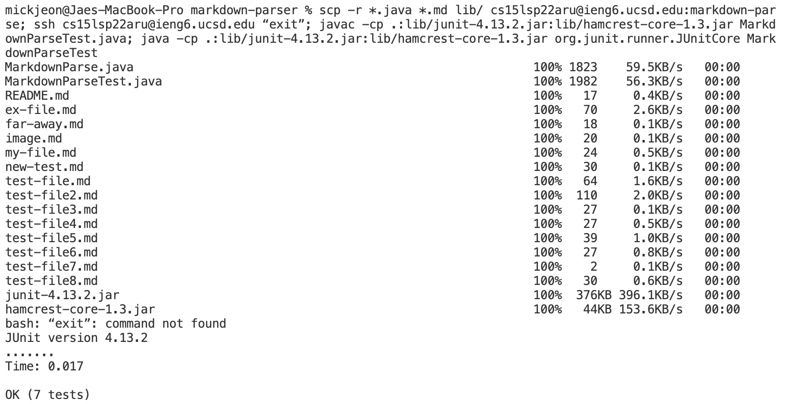

# Lab Report 3, Week 6

## Streamlining ssh Configuration
* **.ssh/config content:**

* **I went into .ssh directory and used vim to create a config file**

* **Logging in using an alias "ieng6"**

* **scp commanding with the alias**

## Setup Github Access from ieng6
* **Public Key stored in Github**

* **Running Git commands**

* [link](https://github.com/mickjeon/markdown-parser/commit/c1cf1f60769942d138c51cd558ffe1891c893bc4) for the resulting commit

## Copy whole directories with scp -r
* **Copying a whole directory**

* **ssh, compile, and run**

* **One line command**

