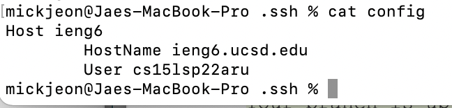
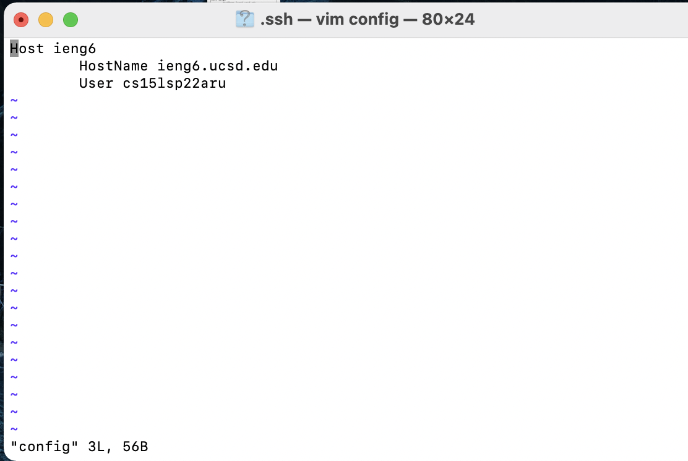
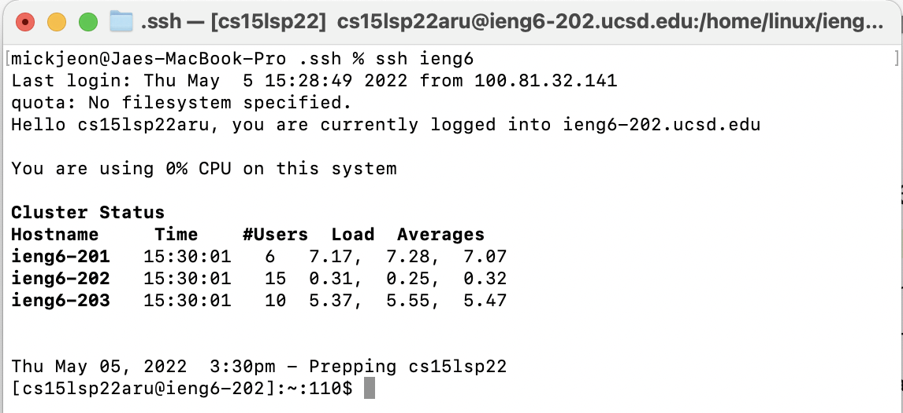
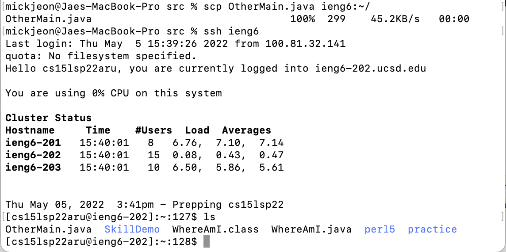

# Lab Report 3, Week 6

## Streamlining ssh Configuration
* .ssh/config content:

* I went into .ssh directory and used vim to create a config file

* Logging in using an alias "ieng6"

* scp commanding with the alias

## Setup Github Access from ieng6

## Copy whole directories with scp -r
