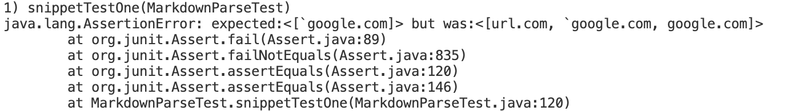
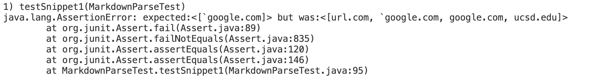
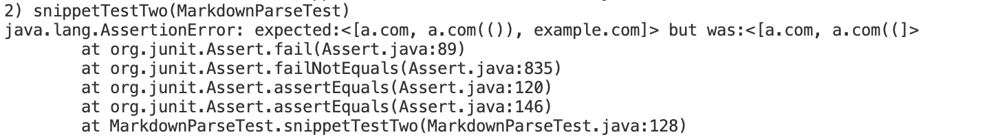
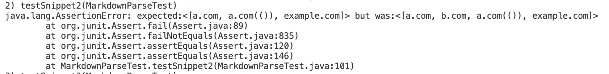
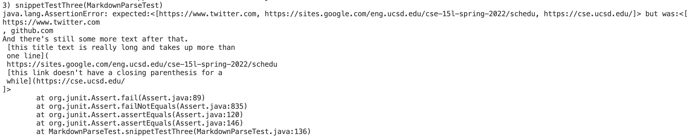
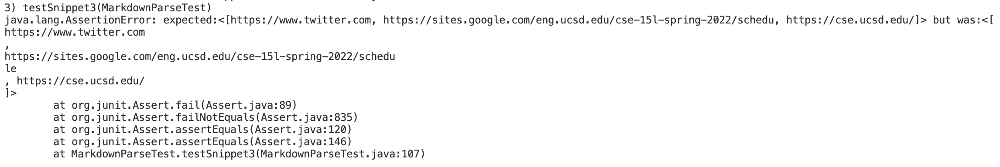

# Lab Report 4, Week 8
[Back to index page](https://mickjeon.github.io/cse15l-lab-reports/index.html)

## Markdown-parse Repository Links
* [mine](https://github.com/mickjeon/markdown-parser.git)
* [one reviewed](https://github.com/canitry/markdown-parser.git)

## Snippet 1
```
`[a link`](url.com)
[another link](`google.com)`
[`cod[e`](google.com)
[`code]`](ucsd.edu)
```
### Expected Output
```
[`google.com]
```


### My Implementation Test Result


### Implementation that I reviewed Test Result


## Snippet 2
```
[a [nested link](a.com)](b.com)
[a nested parenthesized url](a.com(()))
[some escaped \[ brackets \]](example.com)
```

### Expected Output
```
[a.com, a.com(()), example.com]
```

### My Implementation Test Result


### Implementation that I reviewed Test Result



## Snippet 3
```
[this title text is really long and takes up more than
one line
and has some line breaks](
https://www.twitter.com
)
le )
[this link doesn't have a closing parenthesis](github.com
And there's still some more text after that.
 [this title text is really long and takes up more than
 one line](
 https://sites.google.com/eng.ucsd.edu/cse-15l-spring-2022/schedu
 [this link doesn't have a closing parenthesis for a
 while](https://cse.ucsd.edu/
)
And then there's more text
```

### Expected Output
```
[https://www.twitter.com, https://sites.google.com/eng.ucsd.edu/cse-15l-spring-2022/schedu ,https://cse.ucsd.edu/]
```

### My Implementation Test Result

### Implementation that I reviewed Test Result


## Possible Code Change to Make My Program Work For Snippets
1. I believe that issue with backticks cannot be solved with a small code change. In order to process .md files with inline code, I would create a new method that takes in the whole .md file as a string and get ride of inlind code in accordance to the backticks. There are edge cases in this method(starting backtick and ending backtick are in and out of a given set of brackets) so it would require more than 10 lines to code.

2. I believe that issue with nested parentheses, brackets, and escaped brackets cannot be solved with a small code change. In order to take these specials cases into account, I would implement a stack ADT to ensure closing of any open bracket or parantheses.

3. I believe that issue with newlines in brackets and parantheses can be solved with a small code change. I can implement a new method that searches for `\n` in a String and remove all instances. This method would then pass the processed String to getLinks() and it will not have more than 10 lines of code.