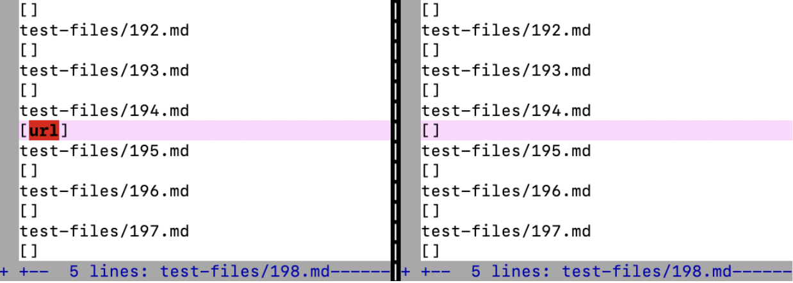

# Lab Report 5, Week 10
[Back to index page](https://mickjeon.github.io/cse15l-lab-reports/index.html)

## How to find tests with different results
* I found tests with different results using `vimdiff \path1\file1 \path2\file2` command. I was able to see the results side by side using this
command and differences between two files were already highlighted for me.

## Link to test files with different results
1. [14.md](https://github.com/nidhidhamnani/markdown-parser/blob/main/test-files/14.md)
2. [194.md](https://github.com/nidhidhamnani/markdown-parser/blob/main/test-files/194.md)

## 14.md
* The expected output is `[]`

* My implementation is correct(shown on the right).
* VSCode preview for 14.md

* The problem with the provided Markdown Parser is that it cannot detect "\"(backslash) usage of escaping. So in line number 3, "\[" must be understood literally as "[" to print, not as a open square bracket for a link. I would make a change at the highlight part below; add to check whether there are any back slash before any of the four indexes.

## 194.md
* The expected output is `my_(url)`

* Neither implementation is correct.
* VSCode preview for 194.md

* The problem with my Markdown Parser is that a link is only added if it contains "."(period). So if a link without a period appears, like `my_(url)`, it is not outputted. I would make a change into the addition condition highlighted below to accomodate this kind of edge cases.
